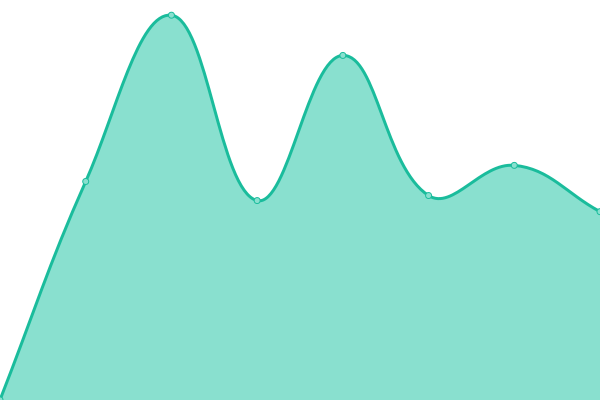
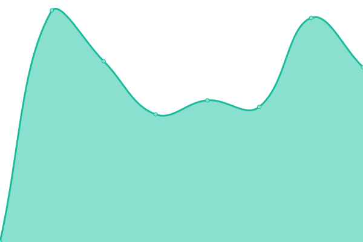
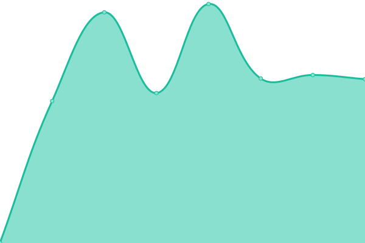

# [📈 Live Status](https://LV-CMilne.github.io/ChanganUpptime-v1): <!--live status--> **🟩 All systems operational**

This repository contains the open-source uptime monitor and status page for [LV_CMilne](https://LV-CMilne.github.io/ChanganUpptime-v1), powered by [Upptime](https://github.com/upptime/upptime).

With [Upptime](https://upptime.js.org), you can get your own unlimited and free uptime monitor and status page, powered entirely by a GitHub repository. We use [Issues](https://github.com/LV_CMilne/ChanganUpptime-v1/issues) as incident reports, [Actions](https://github.com/LV_CMilne/ChanganUpptime-v1/actions) as uptime monitors, and [Pages](https://LV-CMilne.github.io/ChanganUpptime-v1) for the status page.

<!--start: status pages-->
<!-- This summary is generated by Upptime (https://github.com/upptime/upptime) -->
<!-- Do not edit this manually, your changes will be overwritten -->
<!-- prettier-ignore -->
| URL | Status | History | Response Time | Uptime |
| --- | ------ | ------- | ------------- | ------ |
|  [Changan UK](https://www.changaneurope.com/uk) | 🟩 Up | [changan-uk.yml](https://github.com/LV-CMilne/ChanganUpptime-v1/commits/HEAD/history/changan-uk.yml) | 

 2348ms
     
 | 

<a href="https://LV-CMilne.github.io/ChanganUpptime-v1/history/changan-uk">99.81%</a>
    

|  [Changan UK - Contact](https://www.changaneurope.com/uk/contact-us) | 🟩 Up | [changan-uk-contact.yml](https://github.com/LV-CMilne/ChanganUpptime-v1/commits/HEAD/history/changan-uk-contact.yml) | 

 1327ms
     
 | 

<a href="https://LV-CMilne.github.io/ChanganUpptime-v1/history/changan-uk-contact">99.53%</a>
    

|  [Changan UK - Privacy Policy](https://www.changaneurope.com/uk/privacy-policy) | 🟩 Up | [changan-uk-privacy-policy.yml](https://github.com/LV-CMilne/ChanganUpptime-v1/commits/HEAD/history/changan-uk-privacy-policy.yml) | 

 1088ms
     
 | 

<a href="https://LV-CMilne.github.io/ChanganUpptime-v1/history/changan-uk-privacy-policy">99.81%</a>
    

|  [Changan UK - Configurator](https://www.changaneurope.com/uk/configurator) | 🟩 Up | [changan-uk-configurator.yml](https://github.com/LV-CMilne/ChanganUpptime-v1/commits/HEAD/history/changan-uk-configurator.yml) | 

 1373ms
     
 | 

<a href="https://LV-CMilne.github.io/ChanganUpptime-v1/history/changan-uk-configurator">100.00%</a>
    

|  [Changan UK - Book a Test Drive](https://www.changaneurope.com/uk/models/changan-deepal-s07/test-drive) | 🟩 Up | [changan-uk-book-a-test-drive.yml](https://github.com/LV-CMilne/ChanganUpptime-v1/commits/HEAD/history/changan-uk-book-a-test-drive.yml) | 

 1305ms
     
 | 

<a href="https://LV-CMilne.github.io/ChanganUpptime-v1/history/changan-uk-book-a-test-drive">99.61%</a>
    

|  [Changan DE](https://www.changaneurope.com/de) | 🟩 Up | [changan-de.yml](https://github.com/LV-CMilne/ChanganUpptime-v1/commits/HEAD/history/changan-de.yml) | 

 1547ms
     
 | 

<a href="https://LV-CMilne.github.io/ChanganUpptime-v1/history/changan-de">99.45%</a>
    

|  [Changan DE - Contact](https://www.changaneurope.com/de/kontakt) | 🟩 Up | [changan-de-contact.yml](https://github.com/LV-CMilne/ChanganUpptime-v1/commits/HEAD/history/changan-de-contact.yml) | 

 987ms
     
 | 

<a href="https://LV-CMilne.github.io/ChanganUpptime-v1/history/changan-de-contact">99.64%</a>
    

|  [Changan DE - Privacy Policy](https://www.changaneurope.com/de/datenschutzerklarung) | 🟩 Up | [changan-de-privacy-policy.yml](https://github.com/LV-CMilne/ChanganUpptime-v1/commits/HEAD/history/changan-de-privacy-policy.yml) | 

 1510ms
     
 | 

<a href="https://LV-CMilne.github.io/ChanganUpptime-v1/history/changan-de-privacy-policy">99.81%</a>
    

|  [Changan DE - Configurator](https://www.changaneurope.com/de/modellauswahl) | 🟩 Up | [changan-de-configurator.yml](https://github.com/LV-CMilne/ChanganUpptime-v1/commits/HEAD/history/changan-de-configurator.yml) | 

 1240ms
     
 | 

<a href="https://LV-CMilne.github.io/ChanganUpptime-v1/history/changan-de-configurator">99.19%</a>
    

|  [Changan DE - Book a Test Drive](https://www.changaneurope.com/de/probefahrt) | 🟩 Up | [changan-de-book-a-test-drive.yml](https://github.com/LV-CMilne/ChanganUpptime-v1/commits/HEAD/history/changan-de-book-a-test-drive.yml) | 

 1332ms
     
 | 

<a href="https://LV-CMilne.github.io/ChanganUpptime-v1/history/changan-de-book-a-test-drive">99.08%</a>
    

|  [Changan NL](https://www.changaneurope.com/nl) | 🟩 Up | [changan-nl.yml](https://github.com/LV-CMilne/ChanganUpptime-v1/commits/HEAD/history/changan-nl.yml) | 

 1115ms
     
 | 

<a href="https://LV-CMilne.github.io/ChanganUpptime-v1/history/changan-nl">99.23%</a>
    

|  [Changan NL - Contact](https://www.changaneurope.com/nl/contact) | 🟩 Up | [changan-nl-contact.yml](https://github.com/LV-CMilne/ChanganUpptime-v1/commits/HEAD/history/changan-nl-contact.yml) | 

 1060ms
     
 | 

<a href="https://LV-CMilne.github.io/ChanganUpptime-v1/history/changan-nl-contact">99.51%</a>
    

|  [Changan NL - Privacy Policy](https://www.changaneurope.com/nl/privacybeleid) | 🟩 Up | [changan-nl-privacy-policy.yml](https://github.com/LV-CMilne/ChanganUpptime-v1/commits/HEAD/history/changan-nl-privacy-policy.yml) | 

 1031ms
     
 | 

<a href="https://LV-CMilne.github.io/ChanganUpptime-v1/history/changan-nl-privacy-policy">99.56%</a>
    

|  [Changan NL - Configurator](https://www.changaneurope.com/nl/model-chooser) | 🟩 Up | [changan-nl-configurator.yml](https://github.com/LV-CMilne/ChanganUpptime-v1/commits/HEAD/history/changan-nl-configurator.yml) | 

 870ms
     
 | 

<a href="https://LV-CMilne.github.io/ChanganUpptime-v1/history/changan-nl-configurator">100.00%</a>
    

|  [Changan NL - Book a Test Drive](https://www.changaneurope.com/nl/proefrit) | 🟩 Up | [changan-nl-book-a-test-drive.yml](https://github.com/LV-CMilne/ChanganUpptime-v1/commits/HEAD/history/changan-nl-book-a-test-drive.yml) | 

 1299ms
     
 | 

<a href="https://LV-CMilne.github.io/ChanganUpptime-v1/history/changan-nl-book-a-test-drive">99.57%</a>
    

<!--end: status pages-->

[**Visit our status website →**](https://LV-CMilne.github.io/ChanganUpptime-v1)

## 📄 License

- Powered by: [Upptime](https://github.com/upptime/upptime)
- Code: [MIT](./LICENSE) © [Anand Chowdhary](https://anandchowdhary.com), supported by [Pabio](https://pabio.com)
- Data in the `./history` directory: [Open Database License](https://opendatacommons.org/licenses/odbl/1-0/)
